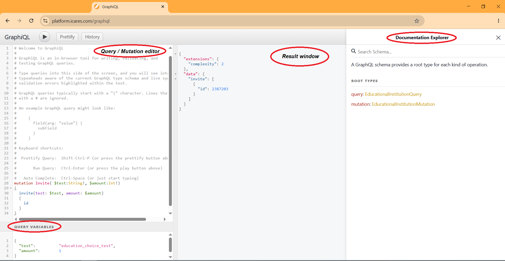

# GraphiQL In-Browser Tool - Quick Start Guide

The GraphiQL in-browser tool allows you to explore, test and validate GraphQL requests directly in your browser before integrating them into your own application.



The interface consists of four main areas:

1. **Query / Mutation editor**
2. **Query Variables editor**
3. **Result window**
4. **Documentation Explorer**

---

## Query vs Mutation

GraphQL supports two types of operations.

### Query

A **Query** retrieves information from the API without changing any data.

Examples:

- Retrieve available test forms
- Retrieve completed test results
- Retrieve education advice

Queries are comparable to SQL `SELECT` statements.

### Mutation

A **Mutation** changes data within the system.

Examples:

- Create a new test invitation
- Start a test
- Submit answers

Mutations are comparable to SQL `INSERT`, `UPDATE` and `DELETE` statements.

---

## Running a Query or Mutation

1. Copy the required Query or Mutation into the **Query / Mutation editor**.
2. If variables are required, copy the accompanying JSON into the **Query Variables** editor.
3. Click the **Run** button (▶).
4. The API response is displayed in the **Result window**.

---

## Selecting the returned data

GraphQL only returns the fields you explicitly request.

For example:

```graphql
query EducationChoiceTestForm
{
  education_choice_test_form
  {
    questions
    {
      id
      question
    }
  }
}
```

returns only the fields:

- `id`
- `question`

If additional information is available, simply add extra fields to the query.

Likewise, removing fields reduces the amount of data returned.

This allows your application to request exactly the information it needs.

---

## Documentation Explorer

The **Documentation Explorer** on the right-hand side contains the complete GraphQL schema.

Use it to:

- browse all available Queries;
- browse all available Mutations;
- inspect available input parameters;
- inspect all available return fields.

Because GraphQL is self-documenting, the Documentation Explorer always reflects the current API.

---

# Example library

The supplied examples are organised into separate folders.

```

GraphiQL-in-browser-tool
│
├── Mutation_invite
│     Create a new test invitation.
│
├── Mutation_submit_test
│     Start a test and submit answers.
│
├── Query_forms
│     Retrieve test form information.
│
└── Query_result
      Retrieve completed test results.

```

Each folder contains ready-to-use examples consisting of:

- a GraphQL Query or Mutation;
- the corresponding Query Variables (if required).

Simply copy both parts into GraphiQL and execute the request.

Most examples can be used immediately after replacing the example IDs or other variable values.
